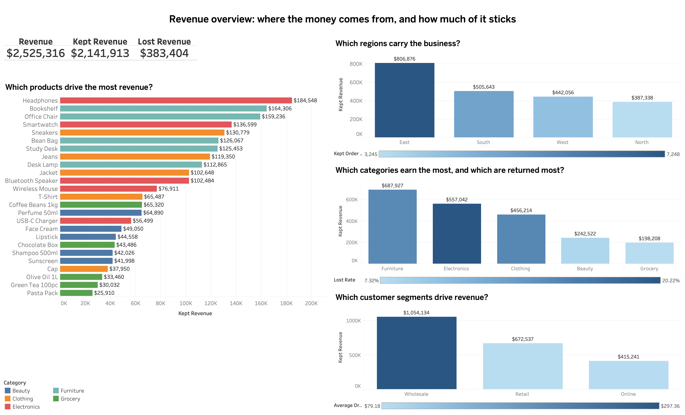
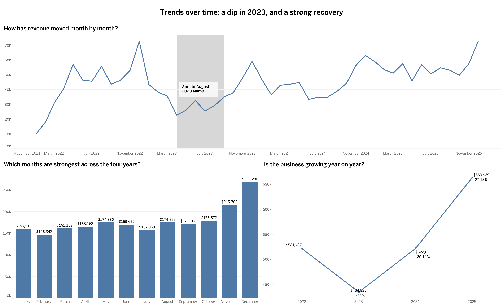
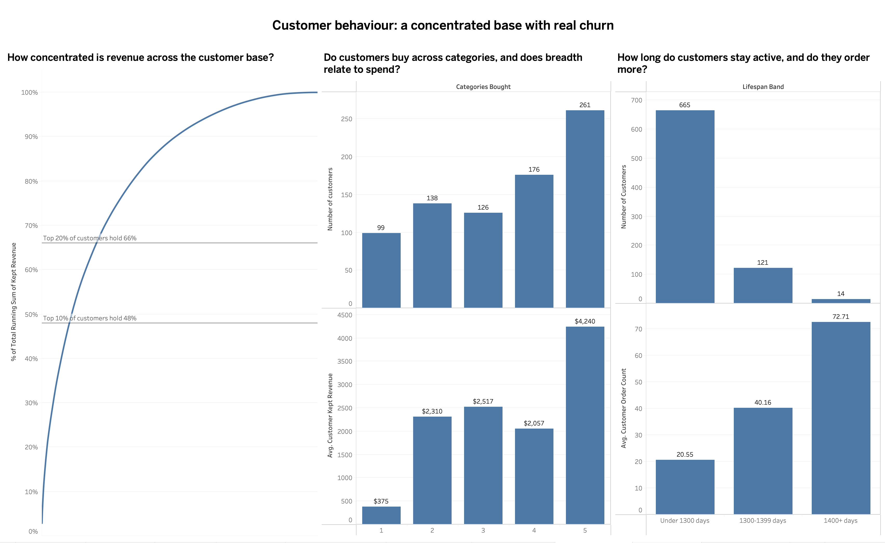
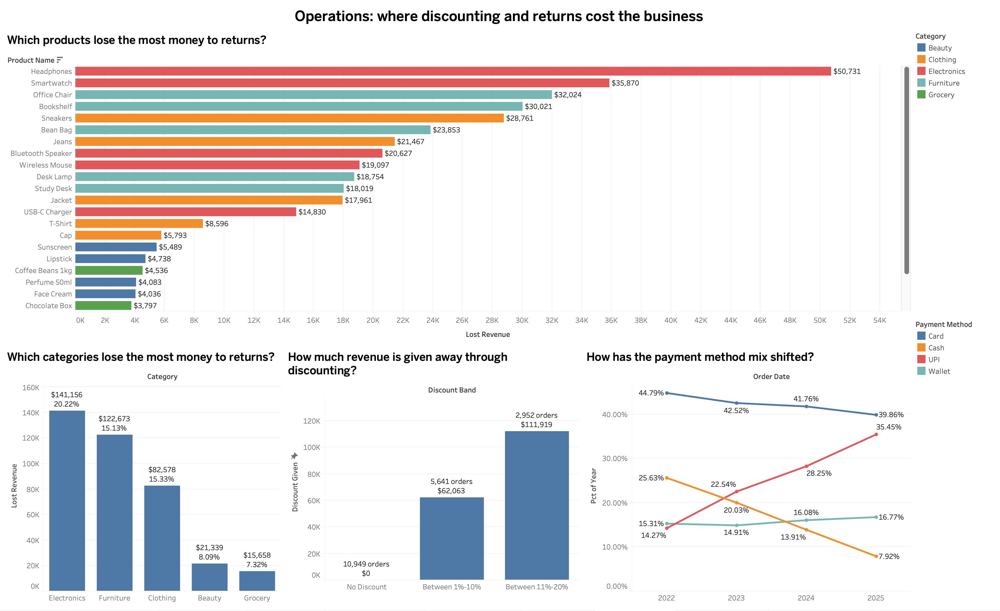

<h1>Retail Sales Analysis: SQL to Dashboard</h1>

<p>An end-to-end analytics project built on a four-year retail transaction dataset. Raw CSV is imported and cleaned in MySQL, analysed through seven SQL scripts answering five sets of business questions, and visualised in five Tableau dashboards.</p>

<p>The project is structured the way an analyst would actually be asked to work: a stakeholder arrives with a question, the SQL answers it, and the dashboard makes the answer readable by someone who does not write SQL.</p>

<p><strong>Live dashboards:</strong> <a href="https://public.tableau.com/views/RetailSalesAnalysis_17911997893050/RevenueOverview?:language=en-US&:sid=&:redirect=auth&:display_count=n&:origin=viz_share_link">View on Tableau Public</a></p>

<hr>

<h2>Contents</h2>

<ul>
  <li><a href="#what-this-project-demonstrates">What this project demonstrates</a></li>
  <li><a href="#the-dataset">The dataset</a></li>
  <li><a href="#repository-structure">Repository structure</a></li>
  <li><a href="#stage-1-building-the-database">Stage 1: Building the database</a></li>
  <li><a href="#stage-2-data-quality-and-cleaning">Stage 2: Data quality and cleaning</a></li>
  <li><a href="#business-question-1-revenue-overview">Business question 1: Revenue overview</a></li>
  <li><a href="#business-question-2-trends-over-time">Business question 2: Trends over time</a></li>
  <li><a href="#business-question-3-customer-behaviour">Business question 3: Customer behaviour</a></li>
  <li><a href="#business-question-4-operations-and-quality">Business question 4: Operations and quality</a></li>
  <li><a href="#business-question-5-product-rankings">Business question 5: Product rankings</a></li>
  <li><a href="#techniques-used">Techniques used</a></li>
  <li><a href="#how-to-reproduce">How to reproduce</a></li>
  <li><a href="#limitations">Limitations</a></li>
</ul>

<hr>

<h2>What this project demonstrates</h2>

<table>
  <thead>
    <tr><th>Area</th><th>What is shown</th></tr>
  </thead>
  <tbody>
    <tr><td>Data import</td><td>LOAD DATA LOCAL INFILE, date parsing, handling blanks as NULL at load time</td></tr>
    <tr><td>Data quality</td><td>Null auditing, duplicate detection, cleaning dirty text values</td></tr>
    <tr><td>Imputation</td><td>Per-product mean imputation, with before and after validation</td></tr>
    <tr><td>SQL analysis</td><td>Aggregation, CTEs, conditional aggregation, derived tables, window functions</td></tr>
    <tr><td>Business framing</td><td>Every query answers a question a stakeholder would actually ask</td></tr>
    <tr><td>Visualisation</td><td>Five Tableau dashboards covering revenue, trends, customers, operations and products</td></tr>
    <tr><td>Honest reporting</td><td>Findings distinguish real signal from noise and state what the data cannot support</td></tr>
  </tbody>
</table>

<p><a href="#retail-sales-analysis-sql-to-dashboard">Back to top</a></p>

<hr>

<h2>The dataset</h2>

<p>A synthetic retail transaction dataset of <strong>19,542 orders</strong> spanning <strong>January 2022 to December 2025</strong>.</p>

<table>
  <thead>
    <tr><th>Field</th><th>Description</th></tr>
  </thead>
  <tbody>
    <tr><td>order_id</td><td>Unique order identifier</td></tr>
    <tr><td>order_date</td><td>Date of order</td></tr>
    <tr><td>customer_id</td><td>One of 800 customers</td></tr>
    <tr><td>customer_segment</td><td>Retail, Online or Wholesale</td></tr>
    <tr><td>region</td><td>East, North, South or West</td></tr>
    <tr><td>category</td><td>One of five product categories</td></tr>
    <tr><td>product_name</td><td>One of 25 products</td></tr>
    <tr><td>price</td><td>Unit price at time of order</td></tr>
    <tr><td>units</td><td>Quantity ordered</td></tr>
    <tr><td>discount_pct</td><td>Discount applied (0, 5, 10, 15 or 20)</td></tr>
    <tr><td>payment_method</td><td>Card, Cash, UPI or Wallet</td></tr>
    <tr><td>order_status</td><td>Delivered, Returned or Cancelled</td></tr>
  </tbody>
</table>

<p><code>revenue</code> is <strong>not</strong> supplied in the raw file. It is derived during cleaning as <code>price * units * (1 - discount_pct/100)</code>, which means the analysis depends on the imputation step being sound.</p>

<p>The dataset is synthetic. I generated it using Claude (Anthropic), specifying the schema, the volume, the patterns I wanted the data to contain, and the data quality problems it should ship with. The intent was to produce something with enough genuine structure to make the analysis meaningful: seasonality, a mid-period downturn, customer concentration, churn, category-specific return behaviour, and a payment mix that shifts over time. The deliberate flaws, missing values and a dirty text column, exist so the cleaning stage has real work to do rather than being a formality.</p>

<p>All SQL, analysis and dashboards in this repository are my own work.</p>

<p><a href="#retail-sales-analysis-sql-to-dashboard">Back to top</a></p>

<hr>

<h2>Repository structure</h2>

```
.
├── README.md
├── sales_data.csv                          # raw data, as received
├── sales_final.csv                         # cleaned export, feeds Tableau
├── 01_Creating_Database_And_Importing.sql
├── 02_Data_Quality.sql
├── 03_Revenue_Overview.sql
├── 04_Trends_Over_Time.sql
├── 05_Customer_Behaviour.sql
├── 06_Operations_Quality.sql
├── 07_Product_Rankings.sql
├── Retail Sales Analysis.twbx              # Tableau workbook, all five dashboards
└── images/
    ├── revenue_overview.jpg
    ├── trends_over_time.jpg
    ├── customer_behaviour.jpg
    ├── operations_quality.jpg
    └── product_rankings.jpg
```

<p><a href="#retail-sales-analysis-sql-to-dashboard">Back to top</a></p>

<hr>

<h2>Stage 1: Building the database</h2>

<p><strong>Script:</strong> 01_Creating_Database_And_Importing.sql</p>

<p>The table is defined explicitly rather than letting an import wizard infer types, so that order_date lands as a DATE and the numeric columns as DECIMAL and INT.</p>

<p>The import itself has two problems to solve. Dates arrive in M/D/YY format, which MySQL will not parse directly. And missing prices and units arrive as empty strings, which MySQL would silently coerce to 0 in a numeric column. A zero price is far more damaging than a NULL, because it would be treated as a real value by every subsequent average and sum.</p>

<p>Both are handled by loading those fields into user variables first, then transforming them on the way in:</p>

```sql
LOAD DATA LOCAL INFILE '/path/to/sales_data.csv'
INTO TABLE sales
FIELDS TERMINATED BY ','
LINES TERMINATED BY '\n'
IGNORE 1 ROWS
(order_id, @order_date, customer_id, customer_segment, region, category,
 product_name, @price, @units, discount_pct, payment_method, order_status)
SET order_date = STR_TO_DATE(@order_date, '%c/%e/%y'),
    price = NULLIF(@price, ''),
    units = NULLIF(@units, '');
```

<p>NULLIF(@price, '') converts an empty string to NULL and passes everything else through unchanged. This is the difference between 781 missing values and 781 silent zeros.</p>

<p><a href="#retail-sales-analysis-sql-to-dashboard">Back to top</a></p>

<hr>

<h2>Stage 2: Data quality and cleaning</h2>

<p><strong>Script:</strong> 02_Data_Quality.sql</p>

<h3>Auditing every column for nulls</h3>

<p>Rather than checking columns one at a time, a single pass reports all twelve:</p>

```sql
SELECT
    SUM(order_id IS NULL)         AS null_order_id,
    SUM(order_date IS NULL)       AS null_order_date,
    SUM(price IS NULL)            AS null_price,
    SUM(units IS NULL)            AS null_units,
    -- ... remaining columns
FROM sales;
```

<p>This relies on price IS NULL evaluating to 1 or 0, so SUM() counts them. Note that COUNT() would not work here: COUNT(price IS NULL) returns the total row count, because both 1 and 0 are non-null values.</p>

<p><strong>Result:</strong> 781 missing prices (4.0%) and 683 missing units (3.5%). Every other column complete.</p>

<h3>Imputing the missing values</h3>

<p>Missing prices and units are filled with the <strong>mean for that specific product</strong>, not the overall mean. A missing Smartwatch price filled with the catalogue average would be wrong by an order of magnitude.</p>

```sql
CREATE TABLE sales_cleaned AS
SELECT
    s.order_id, s.order_date, s.customer_id, s.customer_segment,
    s.region, s.category, s.product_name,
    ROUND(COALESCE(s.price, p.avg_price), 2) AS price,
    ROUND(COALESCE(s.units, p.avg_units))    AS units,
    s.discount_pct, s.payment_method,
    TRIM(REPLACE(s.order_status, '\r', ''))  AS order_status
FROM sales s
JOIN (
    SELECT product_name, AVG(price) AS avg_price, AVG(units) AS avg_units
    FROM sales
    GROUP BY product_name
) p ON s.product_name = p.product_name;
```

<h3>Validating the imputation</h3>

<p>Filling 1,464 values is only safe if it does not distort the data. Category-level averages are compared before and after:</p>

<table>
  <thead>
    <tr><th>Category</th><th>Avg price before</th><th>Avg price after</th><th>Shift</th></tr>
  </thead>
  <tbody>
    <tr><td>Grocery</td><td>$9.52</td><td>$9.50</td><td>-0.21%</td></tr>
    <tr><td>Furniture</td><td>$79.73</td><td>$79.93</td><td>+0.25%</td></tr>
    <tr><td>Electronics</td><td>$54.44</td><td>$54.47</td><td>+0.06%</td></tr>
    <tr><td>Beauty</td><td>$18.79</td><td>$18.84</td><td>+0.27%</td></tr>
    <tr><td>Clothing</td><td>$36.66</td><td>$36.71</td><td>+0.14%</td></tr>
  </tbody>
</table>

<p>The largest shift is a quarter of one percent, and average units are unchanged across all five categories. The imputation is safe to carry forward.</p>

<h3>A dirty data problem worth catching</h3>

<p>A routine SELECT DISTINCT order_status returned four values rather than three, with "Delivered" appearing twice. The two looked identical on screen.</p>

<p>LENGTH() exposed the cause: one version was 9 characters, the other 10. A stray carriage return had attached itself to order_status, the final column in each CSV line, because the file mixed line-ending conventions. Any WHERE order_status = 'Delivered' filter would have silently excluded roughly two thirds of delivered orders.</p>

<p>The fix is the TRIM(REPLACE(s.order_status, '\r', '')) in the cleaning statement above, applied at source so the problem cannot reappear on a rebuild.</p>

<p>This is worth drawing attention to because it is the class of error that does not announce itself. Nothing errors, no row count looks wrong, and every downstream figure is quietly incorrect.</p>

<h3>Deriving revenue</h3>

<p>With the data clean, sales_final is created with the derived revenue column:</p>

```sql
CREATE TABLE sales_final AS
SELECT
    order_id, order_date, customer_id, customer_segment, region,
    category, product_name, price, units, discount_pct,
    payment_method, order_status,
    ROUND(((price * units) * (1 - (discount_pct / 100))), 2) AS revenue
FROM sales_cleaned;
```

<p><strong>19,542 rows, zero nulls, three clean order statuses.</strong> This table feeds every subsequent script and the Tableau workbook.</p>

<p><a href="#retail-sales-analysis-sql-to-dashboard">Back to top</a></p>

<hr>

<h2>Business question 1: Revenue overview</h2>

<blockquote>
  <p><em>"How much money are we making, and where does it come from?"</em></p>
</blockquote>

<p><strong>Script:</strong> 03_Revenue_Overview.sql</p>

<h3>The SQL</h3>

<p>The central technique here is <strong>conditional aggregation</strong>: splitting one measure into several by wrapping a CASE inside the SUM. This answers "how much did we book, and how much did we keep" in a single pass over the table.</p>

```sql
SELECT
    ROUND(SUM(revenue), 2) AS gross_revenue,
    ROUND(SUM(CASE WHEN order_status = 'Delivered' THEN revenue ELSE 0 END), 2) AS kept_revenue,
    ROUND(SUM(CASE WHEN order_status <> 'Delivered' THEN revenue ELSE 0 END), 2) AS lost_revenue
FROM sales_final;
```

<p>The same pattern is then applied with a GROUP BY across region, category, customer segment and product. A CTE holds the aggregates so the loss percentage can be computed from them without repeating the CASE expressions:</p>

```sql
WITH region_wise AS (
    SELECT
        region,
        COUNT(*) AS order_count,
        ROUND(SUM(revenue), 2) AS gross_revenue,
        ROUND(SUM(CASE WHEN order_status = 'Delivered' THEN revenue ELSE 0 END), 2) AS kept_revenue,
        ROUND(SUM(CASE WHEN order_status <> 'Delivered' THEN revenue ELSE 0 END), 2) AS lost_revenue
    FROM sales_final
    GROUP BY region
)
SELECT *,
       ROUND((lost_revenue / gross_revenue) * 100, 2) AS lost_pct
FROM region_wise
ORDER BY kept_revenue DESC;
```

<h3>The findings</h3>

<p><strong>$2,525,316 booked, $2,141,913 kept, $383,404 lost.</strong> The 15.18% loss rate is the single most important number in the dataset: roughly one pound in every seven booked as a sale is subsequently reversed. Any forecast built on gross revenue overstates realised income by about 15%.</p>

<p><strong>Revenue is concentrated in East.</strong> East generates $806,876 from 7,248 orders, more than double North's $387,338 from 3,245. East alone is 37.7% of kept revenue. Average order value is similar across all four regions ($119 to $131), so the gap is driven by order volume rather than basket size.</p>

<p><strong>Volume and value run in opposite directions by category.</strong> Grocery has the most orders (4,663) and the least revenue ($198,208). Furniture has the fewest orders (2,595) and the most revenue ($687,927), 3.5x Grocery's from 44% fewer orders. Furniture and Electronics together hold 58% of revenue from 32% of orders.</p>

<p><strong>Wholesale dominates despite being the smallest segment by volume.</strong> It places 4,022 orders (21% of the total) yet generates $1,054,134, which is 49% of the business and more than Retail and Online combined. Average order value explains it: roughly $297 against $79 for Retail and $82 for Online.</p>

<h3>The dashboard</h3>

<p></p>

<p>The KPI strip gives the headline figures. The three bar charts break revenue down by region, category and segment, with colour carrying a second measure in each case: return rate for categories, order count for regions, average order value for segments. The product ranking at left is coloured by category, which makes the volume-versus-value story visible without a word of explanation, since Grocery items scatter through the middle of the list rather than clustering at the bottom.</p>

<p><a href="#retail-sales-analysis-sql-to-dashboard">Back to top</a></p>

<hr>

<h2>Business question 2: Trends over time</h2>

<blockquote>
  <p><em>"Is the business growing, and is there a pattern to when we sell?"</em></p>
</blockquote>

<p><strong>Script:</strong> 04_Trends_Over_Time.sql</p>

<h3>The SQL</h3>

<p>Three different time grains answer three different questions. The year-over-year growth rate uses LAG() to pull the previous year's value onto the current row, which is the window-function equivalent of a self-join:</p>

```sql
WITH yearly_change AS (
    SELECT
        YEAR(order_date) AS order_year,
        ROUND(SUM(CASE WHEN order_status = 'Delivered' THEN revenue ELSE 0 END), 2) AS kept_revenue
        -- gross, lost and lost_pct also computed
    FROM sales_final
    GROUP BY YEAR(order_date)
),
previous_year AS (
    SELECT *,
           LAG(kept_revenue) OVER (ORDER BY order_year) AS last_revenue
    FROM yearly_change
)
SELECT *,
       ROUND(((kept_revenue - last_revenue) / last_revenue) * 100, 2) AS pct_change
FROM previous_year
ORDER BY order_year;
```

<p>2022 returns NULL for pct_change because there is no prior year. That is the correct output, not a gap to be papered over.</p>

<p>Seasonality needs a different grain again. Grouping by MONTH() rather than by year-month collapses all four Januaries into one row, which strips out growth and leaves only the calendar pattern:</p>

```sql
SELECT
    MONTH(order_date) AS month_number,
    MONTHNAME(order_date) AS month_name,
    ROUND(SUM(CASE WHEN order_status = 'Delivered' THEN revenue ELSE 0 END), 2) AS kept_revenue
FROM sales_final
GROUP BY month_number, month_name
ORDER BY month_number;
```

<h3>The findings</h3>

<p><strong>2023 was the only contraction, and it was severe.</strong> Revenue fell 16.66% to $434,525, driven by a slump running from April to August. April 2023 took $22,827 against $35,901 the month before, and the figure stayed below $33,000 for five consecutive months before recovering from September.</p>

<p><strong>Recovery was strong and sustained:</strong> +20.14% in 2024 and +27.18% in 2025, ending at $663,929, which is 27% above the 2022 base.</p>

<p><strong>The downturn was a volume problem, not a quality one.</strong> Loss rates stayed within a narrow 13.97% to 16.75% band throughout. If returns had spiked alongside the revenue drop, the story would be about product or fulfilment quality. They did not, so customers simply bought less.</p>

<p><strong>December leads in every year without exception,</strong> at $268,286 across the four years against November's $215,704 and February's $146,343. After the top two the ranking flattens sharply: months three through eleven sit between $157,063 and $178,672, a spread too narrow to read as a genuine ordering. The usable signal is a November and December peak against an otherwise level year.</p>

<h3>The dashboard</h3>

<p></p>

<p>The monthly line across all 48 months is the centrepiece, with the April to August 2023 slump shaded and annotated so the event is marked rather than left for the reader to spot. The yearly chart below shows the V-shape of the dip and recovery with growth percentages attached, and the seasonality chart holds months in calendar order so the shape of the year is visible rather than a ranking.</p>

<p><a href="#retail-sales-analysis-sql-to-dashboard">Back to top</a></p>

<hr>

<h2>Business question 3: Customer behaviour</h2>

<blockquote>
  <p><em>"Who are our customers, and how much do we depend on any of them?"</em></p>
</blockquote>

<p><strong>Script:</strong> 05_Customer_Behaviour.sql</p>

<h3>The SQL</h3>

<p>The concentration analysis is the most technically involved query in the project. It chains two window functions: a running total ordered by revenue, divided by the grand total across all customers.</p>

```sql
WITH cust AS (
    SELECT
        customer_id,
        COUNT(*) AS order_count,
        ROUND(SUM(CASE WHEN order_status = 'Delivered' THEN revenue ELSE 0 END), 2) AS kept_revenue,
        ROUND(AVG(revenue), 2) AS avg_order_value
    FROM sales_final
    GROUP BY customer_id
)
SELECT
    customer_id,
    ROW_NUMBER() OVER (ORDER BY kept_revenue DESC) AS customer_rank,
    order_count,
    avg_order_value,
    kept_revenue,
    ROUND(SUM(kept_revenue) OVER (ORDER BY kept_revenue DESC)
          / SUM(kept_revenue) OVER () * 100, 2) AS cumulative_pct
FROM cust
ORDER BY kept_revenue DESC;
```

<p>The two SUM() OVER clauses do different jobs. With ORDER BY it accumulates down the ranked list; with an empty OVER () it returns the grand total. Dividing one by the other gives the share of revenue held by the top N customers, readable directly off any row.</p>

<p>Purchasing breadth and customer lifespan use two-level aggregation: aggregate once to get a per-customer value, then aggregate again across those results.</p>

```sql
WITH cust AS (
    SELECT
        customer_id,
        COUNT(DISTINCT category) AS categories_bought,
        ROUND(SUM(CASE WHEN order_status = 'Delivered' THEN revenue ELSE 0 END), 2) AS kept_revenue
    FROM sales_final
    GROUP BY customer_id
)
SELECT
    categories_bought,
    COUNT(*) AS customer_count,
    ROUND(AVG(kept_revenue), 2) AS avg_kept_revenue
FROM cust
GROUP BY categories_bought
ORDER BY categories_bought;
```

<p>COUNT(*) in the outer query counts customers rather than orders, purely because of what the CTE handed it.</p>

<h3>The findings</h3>

<p><strong>Revenue is heavily concentrated.</strong> The top 10% of customers hold 47.90% of kept revenue, the top 20% hold 66.22%, and the top half account for 90.68%. This is close to a classic Pareto distribution and it changes how the business should be managed: retaining the top tier matters disproportionately, and account management would have something real to target.</p>

<p><strong>Two routes reach the top.</strong> CUST0073 ranks 17th on 140 orders at an average of $115. CUST0765 ranks 6th on just 37 orders at $746. Volume and basket size are separate paths to high value.</p>

<p><strong>Six customers have zero kept revenue</strong> because every order they placed was returned or cancelled, including one whose single $1,395 order was reversed in full. These are not inactive customers; they are active customers whose orders consistently fail, which is a different and more actionable problem.</p>

<p><strong>Purchasing breadth separates customers only at the extremes.</strong> 99 customers buy from a single category and 261 from all five. Single-category customers average $375 kept revenue against $4,240 for five-category customers, an 11x gap. But the middle is flat: two, three and four-category buyers all average between $2,057 and $2,517.</p>

<p><strong>There is real churn.</strong> Lifespans range from 0 to 1,445 days against a possible 1,461, averaging 713. The zero reflects genuine one-time buyers. Order count rises sharply with lifespan: 20.55 average orders under 1,300 days, 40.16 at 1,300-1,399, and 72.71 for the 14 customers surviving 1,400+ days.</p>

<p><em>Caveat worth stating: lifespan is measured as the gap between first and last order, so a customer with more orders will mechanically show a wider span. The relationship is real but partly definitional.</em></p>

<h3>The dashboard</h3>

<p></p>

<p>The cumulative curve on the left is the headline, with reference lines marking the top 10% and 20% thresholds so the concentration can be read rather than inferred from the curve's shape. The two paired charts show breadth and lifespan, each with customer counts above and the behavioural measure below, so the inverse relationship between how many customers sit in a band and how they behave is visible at a glance.</p>

<p><a href="#retail-sales-analysis-sql-to-dashboard">Back to top</a></p>

<hr>

<h2>Business question 4: Operations and quality</h2>

<blockquote>
  <p><em>"What is discounting costing us, where are returns concentrated, and how are customers paying?"</em></p>
</blockquote>

<p><strong>Script:</strong> 06_Operations_Quality.sql</p>

<h3>The SQL</h3>

<p>The cost of discounting is not stored anywhere. It has to be derived as the gap between what an order would have been worth at full price and what it actually earned:</p>

```sql
SELECT
    CASE
        WHEN discount_pct = 0 THEN 'No Discount'
        WHEN discount_pct < 11 THEN 'Between 1%-10%'
        ELSE 'Between 11%-20%'
    END AS discount_band,
    COUNT(*) AS order_count,
    ROUND(SUM(price * units), 2) AS pre_discount_value,
    ROUND(SUM(revenue), 2) AS revenue_after_discount,
    ROUND(SUM(price * units) - SUM(revenue), 2) AS discount_given
FROM sales_final
GROUP BY discount_band
ORDER BY discount_given DESC;
```

<p>price * units is the undiscounted value, already present on every row, so no join or subquery is needed. Note that CASE stops at the first match, which is what makes the three bands mutually exclusive despite the conditions overlapping as written.</p>

<p>The payment mix needs each year's four methods to sum to 100%, which requires a windowed aggregate inside a grouped query:</p>

```sql
SELECT
    YEAR(order_date) AS order_year,
    payment_method,
    COUNT(*) AS payment_count,
    ROUND(COUNT(*) / SUM(COUNT(*)) OVER (PARTITION BY YEAR(order_date)) * 100, 2) AS pct_of_year
FROM sales_final
GROUP BY payment_method, order_year
ORDER BY payment_method, order_year;
```

<p>SUM(COUNT(*)) OVER (PARTITION BY ...) looks odd but is standard: the COUNT runs first as part of the GROUP BY, then the window function sums those counts within each year.</p>

<h3>The findings</h3>

<p><strong>Discounting cost $173,982 over the period, 6.4% of the $2.70M pre-discount value.</strong> Most orders carry no discount at all: 10,949 of 19,542, or 56%.</p>

<p><strong>The cost is driven by depth, not breadth.</strong> The 2,952 orders discounted 11-20% gave away $111,919, nearly twice the $62,063 from the 5,641 orders discounted 1-10%, despite being roughly half as many. Tightening the deep band would save more than eliminating shallow discounts entirely.</p>

<p><strong>Electronics leads on both loss measures.</strong> It loses $141,156 at a 20.22% rate, clear of Furniture's $122,673 at 15.13%. Beauty and Grocery lose $36,997 between them at rates around 7 to 8%. Loss is concentrated in a category that is both high-value and high-return, which makes Electronics the clear target for any returns-reduction effort.</p>

<p><strong>At product level, losses reflect price, volume and return rate combined.</strong> Headphones tops the list at $50,731, double Smartwatch's $35,870 despite being the cheaper product, because it sells 2.4x as often. Return rates split by category rather than by price: all five Electronics products sit between 16.75% and 21.56%, all five Grocery products between 6.49% and 8.29%. The driver is what the product is, not what it costs.</p>

<p><strong>The payment mix has shifted substantially.</strong> Cash fell from 25.63% of orders in 2022 to 7.92% in 2025, losing roughly two thirds of its share, while UPI rose from 14.27% to 35.45%. The two cross over during 2023. Card declined gently from 44.79% to 39.86% and Wallet held steady around 15 to 17%, so the shift is specifically a migration from cash to UPI rather than a broad realignment.</p>

<h3>The dashboard</h3>

<p></p>

<p>The product loss ranking runs across the top, coloured by category so the Electronics concentration is immediately visible. Below it, the category chart carries both absolute loss and loss rate on each bar, the discount chart shows order counts alongside cost so the depth-versus-breadth point reads directly off the chart, and the payment mix uses a line chart because the crossing of Cash and UPI is the finding.</p>

<p><a href="#retail-sales-analysis-sql-to-dashboard">Back to top</a></p>

<hr>

<h2>Business question 5: Product rankings</h2>

<blockquote>
  <p><em>"Which products lead, and does price determine performance?"</em></p>
</blockquote>

<p><strong>Script:</strong> 07_Product_Rankings.sql</p>

<h3>The SQL</h3>

<p>Top N within each group is the canonical window function problem, and it cannot be done with GROUP BY alone. RANK() with PARTITION BY restarts the ranking for each category:</p>

```sql
WITH top AS (
    SELECT
        category,
        product_name,
        ROUND(SUM(CASE WHEN order_status = 'Delivered' THEN revenue ELSE 0 END), 2) AS total_revenue
    FROM sales_final
    GROUP BY product_name, category
),
ranked AS (
    SELECT *,
        RANK() OVER (PARTITION BY category ORDER BY total_revenue DESC) AS rnk,
        SUM(total_revenue) OVER (PARTITION BY category) AS category_total,
        ROUND(total_revenue / (SUM(total_revenue) OVER (PARTITION BY category)) * 100, 2) AS pct_of_category
    FROM top
)
SELECT *
FROM ranked
WHERE rnk < 4
ORDER BY category, rnk;
```

<p>Three window functions in one query, all partitioned by category: one ranks, one totals, and the third expresses each product as a share of its category.</p>

<p>The same pattern answers each region's peak month, with ROW_NUMBER() rather than RANK() because exactly one row per region is wanted.</p>

<p>The price comparison introduces a frameless window, AVG(...) OVER (), which computes the grand mean and attaches it to every row without collapsing them:</p>

```sql
WITH product_prices AS (
    SELECT
        product_name, category,
        ROUND(AVG(price), 2) AS avg_price,
        ROUND(SUM(CASE WHEN order_status = 'Delivered' THEN revenue ELSE 0 END), 2) AS total_revenue
    FROM sales_final
    GROUP BY product_name, category
)
SELECT
    product_name, category, avg_price,
    ROUND(AVG(avg_price) OVER (), 2) AS overall_avg_price,
    CASE
        WHEN avg_price >= AVG(avg_price) OVER () THEN 'Above average'
        ELSE 'Below average'
    END AS price_position,
    total_revenue
FROM product_prices
ORDER BY avg_price DESC;
```

<h3>The findings</h3>

<p><strong>Every category is dominated by its top three,</strong> which account for 65% to 76% of category revenue. Furniture is the flattest, with Bookshelf at 23.88% and Office Chair at 23.15% almost level. Electronics is the most top-heavy, with Headphones alone at 33.13%.</p>

<p><strong>The ranking is not the price list.</strong> Study Desk, the most expensive product in the catalogue at $189.63, does not place in Furniture's top three at all, selling 207 times against Bookshelf's 475. Revenue leadership reflects the balance of price and demand, not price alone.</p>

<p><strong>Three of four regions peak in December</strong> (East in Dec 2022 at $35,207, North in Dec 2024, West in Dec 2025), consistent with the seasonality found in script 04. South is the exception, peaking in January 2025 at $20,281. East's peak is more than double North's, which reflects the regional size gap rather than any timing difference.</p>

<p><strong>Price position is a poor predictor of revenue.</strong> Nine of 25 products sit above the overall average price of $51.10, but several below-average products out-earn above-average ones. Jeans ($119,350) beats Jacket ($102,648), and Desk Lamp at $36.95 earns $112,865, more than Bluetooth Speaker at nearly twice the price. Price sets the tier a product can reach; demand decides where within it the product lands.</p>

<h3>The dashboard</h3>

<p></p>

<p>The top-three-by-category chart groups products under their category so the within-group ranking is readable at a glance. The scatter plot is the right form for the price question because it shows two measures against each other, with a computed reference line at the $51.10 average splitting the catalogue and colour marking which side each product falls on. The visible overlap between the two colour groups is the finding.</p>

<p><a href="#retail-sales-analysis-sql-to-dashboard">Back to top</a></p>

<hr>

<h2>Techniques used</h2>

<h3>SQL</h3>

<table>
  <thead>
    <tr><th>Technique</th><th>Where it appears</th></tr>
  </thead>
  <tbody>
    <tr><td>LOAD DATA LOCAL INFILE with user variables</td><td>Script 01</td></tr>
    <tr><td>NULLIF, STR_TO_DATE at load time</td><td>Script 01</td></tr>
    <tr><td>SUM(condition) for boolean counting</td><td>Script 02</td></tr>
    <tr><td>COALESCE for imputation</td><td>Script 02</td></tr>
    <tr><td>TRIM, REPLACE, LENGTH for dirty text</td><td>Script 02</td></tr>
    <tr><td>Derived tables (subquery in FROM)</td><td>Script 02</td></tr>
    <tr><td>Conditional aggregation with CASE inside SUM</td><td>Scripts 03 to 07</td></tr>
    <tr><td>Common table expressions, including chained CTEs</td><td>Scripts 03 to 07</td></tr>
    <tr><td>DATE_FORMAT, YEAR, MONTH, MONTHNAME, DATEDIFF</td><td>Scripts 04, 05</td></tr>
    <tr><td>LAG() for period-over-period comparison</td><td>Script 04</td></tr>
    <tr><td>ROW_NUMBER(), RANK()</td><td>Scripts 05, 07</td></tr>
    <tr><td>SUM() OVER (ORDER BY ...) running totals</td><td>Script 05</td></tr>
    <tr><td>SUM() OVER () grand totals as denominators</td><td>Scripts 05, 06</td></tr>
    <tr><td>PARTITION BY for per-group windows</td><td>Scripts 06, 07</td></tr>
    <tr><td>Two-level aggregation</td><td>Script 05</td></tr>
    <tr><td>UNION ALL</td><td>Script 03</td></tr>
  </tbody>
</table>

<h3>Tableau</h3>

<p>Level of detail expressions (FIXED), table calculations with secondary calculations, RANK() and LOOKUP() calculated fields, dual-axis charts, computed and constant reference lines and bands, annotations, and five multi-sheet dashboards.</p>

<p><a href="#retail-sales-analysis-sql-to-dashboard">Back to top</a></p>

<hr>

<h2>How to reproduce</h2>

<ol>
  <li>Clone the repository and create a MySQL schema.</li>
  <li>Open 01_Creating_Database_And_Importing.sql and <strong>update the file path</strong> on the LOAD DATA line to point at your local copy of sales_data.csv.</li>
  <li>Run script 01. If MySQL rejects the load, local_infile needs enabling on both the server and the client. Run <code>SET GLOBAL local_infile = 1;</code> and, in MySQL Workbench, add <code>OPT_LOCAL_INFILE=1</code> under Edit Connection, Advanced, Others, then restart Workbench completely.</li>
  <li>Run script 02 to clean the data and build sales_final. The script includes verification queries at each stage.</li>
  <li>Run scripts 03 to 07 in any order. Each is independent and reads only from sales_final.</li>
  <li>For the dashboards, export sales_final to CSV and connect Tableau to the file, or connect Tableau directly to the MySQL database.</li>
</ol>

<p><a href="#retail-sales-analysis-sql-to-dashboard">Back to top</a></p>

<hr>

<h2>Limitations</h2>

<p>The dataset is <strong>synthetic</strong>, generated using Claude (Anthropic) to my specification. It was built to exhibit realistic retail patterns so that the analysis has genuine structure to find, but it is not real transaction data and no conclusion here describes an actual business.</p>

<p>Two specific consequences are worth naming. Early 2022 shows a ramp-up as the customer base builds rather than normal trading, so the first few months are not comparable with later periods. And the relationship between customer lifespan and order count is partly definitional, since lifespan is derived from the first and last order dates.</p>

<p>Where a pattern appeared that the data could not support, the findings say so rather than claiming it. Several comparisons in this project are reported as non-findings for that reason.</p>

<p><a href="#retail-sales-analysis-sql-to-dashboard">Back to top</a></p>
